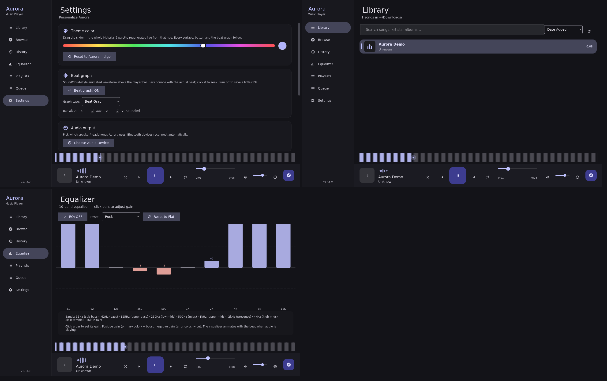

# Aurora Music Player v21.0.0

> **A custom-built, native Linux music player written in Python + PySide6 (Qt 6).**  
> Material 3 design, Monstercat visualizer smoothing, MPRIS/playerctl support, agent-friendly CLI & IPC, online Browse with full-track downloads, infinite scroll, and a 6-strategy YouTube bot-protection bypass.

<p align="center">
  
</p>

---

## 🎯 What is Aurora?

Aurora Music Player is a **from-scratch, single-file Python application** (`aurora_player.py` — ~386 KB, ~6,500 lines) built with:

- **PySide6 (Qt 6)** — native widgets, no Electron, no web runtime
- **Qt Multimedia** — hardware-accelerated playback
- **MPRIS (mpris_server)** — `playerctl` / media keys work out of the box
- **mutagen** — MP3/FLAC/M4A tagging + embedded cover art
- **yt-dlp + ffmpeg** — full-track downloads from YouTube
- **iTunes Search API** — free, no-key, no-auth online search (Browse feature)

**Design philosophy:** Lightweight (~120–150 MB RAM), Celeron-friendly, zero bloat, fully hackable. Every feature is in one readable file — fork it, extend it, learn from it.

---

## ✨ Feature Matrix

| Category | Features |
|----------|----------|
| **Playback** | Play/pause/stop/next/prev, seek, volume, shuffle, repeat (off/all/one), gapless-ish track switching (120 ms volume ramp) |
| **Library** | Auto-scans music folders dynamically, supports MP3/M4A/FLAC/OGG/WAV/OPUS/AAC/WMA, live search + multi-column sort |
| **Playlists** | Create/rename/delete, drag-reorder, multi-select "Add to playlist" from library, right-click context menu, persists to `~/.aurora-player/playlists.json` |
| **Queue** | Add to end / play next, remove (Del/right-click), move up/down, clear, save as playlist, double-click to jump-play, now-playing highlight follows auto-advance |
| **Browse (Online)** | iTunes Search API (8 storefronts: US/IN/GB/CA/AU/DE/FR/JP), live auto-suggestions (250 ms debounce), infinite scroll (200 result cap), country-specific seed queries |
| **Downloads** | Full-track MP3 (~190 kbps VBR) via yt-dlp + ffmpeg, iTunes metadata + 600×600 cover art embedded (mutagen APIC), serialized queue, idempotent (skips existing) |
| **YouTube Bot Bypass** | **6 strategies in sequence:** (1) `cookies-from-browser` (auto-detect Firefox/Chrome/Brave/Edge/Opera/Safari/Vivaldi/Whale) · (2) `cookies.txt` (Netscape format) · (3) Client rotation (`ios,android,tv,web,web_safari`) · (4) Invidious API (3 instances) · (5) SAPISIDHASH Innertube direct `/youtubei/v1/player` with 5-client rotation · (6) Plain yt-dlp (last resort) |
| **Theme Studio** | Hue slider (0–359) → full Material 3 dark palette regenerates live (all surfaces, buttons, sliders, icons, beat graph). Default seed: `#6366F1` (Aurora indigo) |
| **Beat Graph** | Monstercat-smoothed SoundCloud-style waveform from **real per-track peak levels** (async `QAudioDecoder`), bars bounce at playhead, travelling shimmer wave, pulsing playhead dot, click/drag to seek |
| **MPRIS / playerctl** | `play`, `pause`, `play-pause`, `stop`, `next`, `previous`, `seek`, `volume`, `shuffle`, `loop` — all marshalled to Qt main thread |
| **CLI & IPC** | `--status` (rich JSON), `--play-file`, `--toggle`, `--play/--pause/--stop/--next/--prev`, queue/playlist/theme commands, headless Browse search (`--browse-itunes`) |
| **System Tray** | Show/hide, play/pause, next, prev, quit — native Qt tray icon |
| **Keyboard Shortcuts** | Space (play/pause), ←/→ (seek ±5 s), ↑/↓ (volume ±5%), F5 (rescan), Ctrl+F (focus search), Escape (clear search/close dialogs) |
| **Window State** | Geometry + maximized state persisted to `~/.aurora-player/window_state.json` |
| **Packaging** | `.deb` (Debian/Ubuntu/Kali), AppImage (portable), PKGBUILD (Arch), Flatpak, RPM `.spec` (Fedora) |

---

## 🚀 Quick Start

### Option 1: Install `.deb` (Debian / Ubuntu / Kali / Mint / Pop!_OS)

```bash
# Download the release package, then:
sudo apt install ./packages/aurora-music_21.0.0_all.deb
aurora-music          # or find "Aurora Music" in your app menu
```

**Uninstall:** `sudo apt remove aurora-music`

---

### Option 2: Run from source (any Linux with Python 3.9+)

```bash
# 1. Unzip the release
unzip aurora-music-21.0.0-source.zip -d ~/aurora-music
cd ~/aurora-music/aurora-player

# 2. Install dependencies (uses --break-system-packages on PEP 668 systems)
bash install.sh

# 3. Run
aurora-player --version   # → Aurora Music Player v21.0.0
aurora-player             # launches the GUI
```

If `aurora-player` not found:
```bash
export PATH="$HOME/.local/bin:$PATH"
# add to ~/.bashrc or ~/.zshrc to make permanent
```

---

### Option 3: Manual (venv)

```bash
python3 -m venv ~/.aurora-venv
~/.aurora-venv/bin/pip install PySide6 mpris_server mutagen
~/.aurora-venv/bin/python aurora-player/aurora_player.py
```

---

### Option 4: AppImage (portable, no install)

```bash
bash linux-packages/build-appimage.sh
./aurora-music-x86_64.AppImage
```

---

## 📦 Requirements

| Runtime | Install Command |
|---------|-----------------|
| Python | 3.9+ (3.11+ recommended) |
| PySide6 | `pip install --break-system-packages PySide6` |
| mpris_server | `pip install --break-system-packages mpris_server` |
| mutagen | `pip install --break-system-packages mutagen` |
| ffmpeg | `sudo apt install ffmpeg` (required for downloads) |
| yt-dlp | `pip install --break-system-packages yt-dlp` (required for Browse downloads) |
| playerctl | `sudo apt install playerctl` (optional, for media keys) |

**System Qt libs** (if Qt fails to start):
```bash
sudo apt install libegl1 libgl1 libxkbcommon0 libdbus-1-3 libfontconfig1
```

---

## 🎮 Usage

### GUI
- **Library** — local files from `~/Downloads/`
- **Browse** — online search (iTunes API), infinite scroll, download full tracks
- **Playlists** — double-click to open detail page, right-click library → "Add to playlist"
- **Queue** — right-click → remove, drag-reorder (move up/down buttons), Del key
- **Settings** — hue slider (live theme), beat graph toggle, audio output device
- **Player Bar** — always visible: album art, title/artist, seek bar, volume, play/pause, next/prev, shuffle, repeat, beat graph

### CLI (for agents / scripts / hotkeys)

```bash
# Playback
aurora-player --play-file ~/Downloads/song.mp3
aurora-player --play | --pause | --toggle | --stop | --next | --prev

# Status (rich JSON)
aurora-player --status | jq .

# Queue
aurora-player --queue-file ~/Downloads/song.mp3
aurora-player --queue-next-file ~/Downloads/song.mp3
aurora-player --queue-remove 3
aurora-player --queue-clear

# Playlists
aurora-player --list-playlists
aurora-player --new-playlist "Workout"
aurora-player --add-to-playlist "Workout" ~/Downloads/song.mp3
aurora-player --play-playlist "Workout"

# Theme
aurora-player --set-theme 239    # 0-359 hue (239 = default indigo)

# Browse (headless — no GUI needed)
aurora-player --browse-itunes "taylor swift" US 0    # page 1 (offset 0)
aurora-player --browse-itunes "taylor swift" US 50   # page 2
aurora-player --browse-search "arijit singh"         # switch to Browse + search
aurora-player --browse-country IN                     # switch storefront
aurora-player --browse-load-more                      # trigger next page
aurora-player --browse-download 1440818839            # full-track download by trackId
aurora-player --browse-auth-status                    # show YouTube auth config
```

### MPRIS (playerctl)
```bash
playerctl --player=aurora play-pause
playerctl --player=aurora next
playerctl --player=aurora previous
playerctl --player=aurora position 120000000    # seek to 2:00 (microseconds)
playerctl --player=aurora volume 0.8            # 0.0–1.0
playerctl --player=aurora metadata              # current track info
```

---

## 🔍 Browse Feature — Deep Dive

### How it works
1. **Search** — iTunes Search API (`https://itunes.apple.com/search`) — free, no key, ~20 req/min
2. **Results** — 50 per page, paginated via `offset` parameter, capped at 200 total
3. **Artwork** — iTunes returns 100×100; we rewrite URL to 300×300 (grid) and 600×600 (download embed)
4. **Download** — when you click **Download**:
   - YouTube search: `ytsearch3:"{artist} {title}"` via yt-dlp
   - Best match selected → audio stream downloaded → ffmpeg → MP3 VBR ~190 kbps
   - mutagen tags: title, artist, album, genre, release date, **APIC cover art (600×600)**
   - File saved: `~/Downloads/<Artist> - <Title>.mp3`
   - Library auto-rescans → tray notification

### YouTube Bot-Protection Bypass (v17.5+)

| # | Strategy | Trigger | Config |
|---|----------|---------|--------|
| 1 | `cookies-from-browser` | Auto-detects Firefox/Chrome/Chromium/Brave/Edge/Opera/Safari/Vivaldi/Whale | Sign into YouTube in browser |
| 2 | `cookies.txt` | User provides Netscape-format cookie file | Export via "Get cookies.txt LOCALLY" extension |
| 3 | Client rotation | `yt-dlp --extractor-args youtube:player_client=ios,android,tv,web,web_safari` | None (mobile clients rarely blocked) |
| 4 | Invidious API | 3 instances: `vid.puffyan.us`, `invidious.perennialte.ch`, `yewtu.be` | None |
| 5 | SAPISIDHASH Innertube | Direct `/youtubei/v1/player` call with `Authorization: SAPISIDHASH <hash>` + 5-client rotation | Paste `Cookie:` header (must contain `SAPISID` or `__Secure-1PAPISID`) in Settings → YouTube Auth |
| 6 | Plain yt-dlp | Last resort for non-bot-protected videos | None |

**Status bar** shows which strategy succeeded: `[via client-rotation]`, `[via invidious]`, `[via cookies-from-browser]`, etc.

### Settings → YouTube Auth Card
- **Strategy dropdown** — Auto (try all) / Browser cookies / cookies.txt / SAPISIDHASH / No auth
- **Browser picker** — which browser to extract cookies from
- **cookies.txt picker** — file dialog for Netscape-format cookie file
- **SAPISID cookie field** — paste full `Cookie:` header from DevTools (Network tab → any youtube.com request)

---

## 🎨 Material 3 Theme System

Aurora implements **Google's Material Design 3 (M3) dark theme** translated to Qt Style Sheets:

- **Seed color** → full tonal palette (primary/secondary/tertiary + containers + surfaces + outlines)
- **Token names** mirror Compose `MaterialTheme.colorScheme` (`primary`, `on_primary_container`, `surface_container_high`, …)
- **Type scale** — `headline_large` → `label_small` (page titles → time labels)
- **Shape scale** — FAB (56 dp, 16 dp corners), pill nav items (28 dp), full-pill search bar (28 dp)
- **State layers** — hover 8%, press 12% (precomputed for QSS)
- **Tonal elevation** — depth via surface container tones, no shadows

**Live retheme:** Drag the hue slider in Settings → entire app regenerates palette instantly (including beat graph).

---

## 📊 Beat Graph Visualizer

- **Source:** Real per-track peak levels via `QAudioDecoder` (async, off UI thread)
- **Fallback:** Pseudo-waveform from duration + hash (for undecodable codecs)
- **Animation:** 30 fps while playing only; bars bounce near playhead, shimmer wave travels, playhead dot pulses
- **Interaction:** Click/drag anywhere on graph to seek
- **Performance:** Pure `QPainter`, no shaders, Celeron-friendly

---

## 🤖 Agent / AI Integration

Aurora is designed to be **driven by AI agents** (Claude Code, Codex, Hermes, etc.):

- **Single-instance lock** — second launch prints `Already running` and exits cleanly
- **IPC via CLI** — every action is a CLI flag, returns JSON on `--status`
- **MPRIS** — standard D-Bus interface, works with any MPRIS client
- **File IPC** — `~/.aurora-player/ipc_command` (legacy, still works)
- **Rich `--status` JSON** includes:
  ```json
  {
    "state": "Playing",
    "title": "The Fate of Ophelia",
    "artist": "Taylor Swift",
    "position_ms": 45231,
    "duration_ms": 187451,
    "volume": 0.78,
    "shuffle": true,
    "repeat": "all",
    "queue": [...],
    "queue_index": 2,
    "playlists": {"Workout": 12, "Chill": 8},
    "theme_hue": 239,
    "browse": {
      "query": "taylor swift",
      "results_count": 50,
      "country": "US",
      "has_more": true,
      "downloading": "1440818839",
      "queue_size": 2,
      "last_strategy_used": "client-rotation"
    }
  }
  ```

---

## 📁 Project Structure

```
aurora-music-21.0.0/
├── aurora-player/
│   ├── aurora_player.py        # Main application (~6,500 lines, single file)
│   ├── install.sh              # User-space installer (~/.local/)
│   ├── requirements.txt        # PySide6, mpris_server, mutagen
│   ├── app-icon.png            # 1024×1024
│   ├── icon-512.png / icon-256.png
│   └── banner.png              # 1920×600
├── skill/
│   ├── AGENT_PROMPT.md         # How to drive Aurora from an AI agent
│   ├── download_song.py        # Standalone downloader (JioSaavn → SoundCloud → YouTube)
│   ├── smart_music_picker.py   # 1,592-song weighted picker (Phonk 30%, Hip-Hop 25%, …)
│   └── random_songs.txt        # Curated seed list
├── packaging/
│   └── build_deb.sh            # Builds .deb from source
├── linux-packages/
│   ├── build-debian.sh         # Alternative .deb builder
│   ├── build-appimage.sh       # AppImage builder (linuxdeploy + appimagetool)
│   ├── PKGBUILD                # Arch Linux package
│   ├── aurora-music.spec       # Fedora/RPM spec
│   └── com.aurora.Music.json   # Flatpak manifest
├── packages/
│   └── aurora-music_21.0.0_all.deb   # Pre-built .deb
├── README.md                   # This file
├── INSTALL.md                  # Installation guide
└── screenshots/                # UI screenshots (see below)
```

---

## 🖼️ Screenshots

| Overview | Library | Browse (India) | Equalizer |
|----------|---------|----------------|-----------|
|  |  |  |  |

| Settings (Hue Slider) | History | Browse Preview Playing |
|-----------------------|---------|------------------------|
|  |  |  |

---

## 🔧 Building Packages

### Debian / Ubuntu / Kali (.deb)
```bash
bash packaging/build_deb.sh
# Output: packages/aurora-music_21.0.0_all.deb
```

### AppImage (portable)
```bash
# Requires: linuxdeploy, appimagetool (download from GitHub releases)
bash linux-packages/build-appimage.sh
# Output: aurora-music-x86_64.AppImage
```

### Arch Linux (PKGBUILD)
```bash
cd linux-packages
makepkg -si
```

### Flatpak
```bash
flatpak-builder build-dir linux-packages/com.aurora.Music.json
flatpak build build-dir aurora-music
```

### Fedora / RPM
```bash
rpmbuild -ba linux-packages/aurora-music.spec
```

---

## 🧠 Architecture Highlights

### Single-File Design
`aurora_player.py` contains **everything**: UI, playback, MPRIS adapter, library scanner, browse fetcher, downloader, playlist/queue managers, theme engine, beat graph, settings persistence, CLI parser, single-instance lock, IPC.  
**Why?** Easy to audit, fork, embed, copy-paste into another project. No dependency hell.

### Threading Model
| Thread | Purpose |
|--------|---------|
| Main (Qt) | UI, playback, MPRIS marshaling, all signals/slots |
| `ScannerThread` | Library scan (mutagen metadata extraction) — every 30 s + manual |
| `BrowseFetcher` / `SuggestFetcher` | iTunes HTTP requests (QNetworkAccessManager) |
| `ThumbnailLoader` | Async image download + LRU cache (200 entries) |
| `Downloader` | yt-dlp subprocess + ffmpeg + mutagen tagging (serialized queue) |
| `AudioDecoderThread` | `QAudioDecoder` for beat graph peak extraction |
| `MPRIS GLib Loop` | `mpris_server.Server.loop(background=True)` daemon thread |

**Thread safety:** All cross-thread calls use Qt signals → queued connections → main thread. MPRIS commands marshalled via dedicated `mprisCommand` signal.

### Data Persistence
| File | Content |
|------|---------|
| `~/.aurora-player/settings.json` | theme_hue, beat_graph_enabled, audio_device, window_state, playlists, queue, browse_auth_config |
| `~/.aurora-player/playlists.json` | Playlist definitions (name → [file paths]) |
| `~/.aurora-player/window_state.json` | Geometry + maximized flag |

---

## 🐛 Troubleshooting

| Symptom | Fix |
|---------|-----|
| `command not found: aurora-player` | `export PATH="$HOME/.local/bin:$PATH"` (add to `~/.bashrc`) |
| Qt fails to start (EGL/GL errors) | `sudo apt install libegl1 libgl1 libxkbcommon0 libdbus-1-3 libfontconfig1` |
| No sound / wrong device | Settings → Audio Output Device → pick correct `QAudioDevice` |
| Downloads fail (bot detection) | Settings → YouTube Auth → choose strategy (browser cookies recommended) |
| `playerctl` shows "No players found" | `pip install --break-system-packages mpris_server` then restart Aurora |
| Library empty | Drop files in `~/Downloads/` or press F5; supported: mp3/m4a/flac/ogg/wav/opus/aac/wma |
| Theme not applying | Restart Aurora (live retheme works in Settings, but some widgets need restart) |
| High CPU on idle | Disable beat graph in Settings (30 fps painter while playing only) |

---

## 📜 Version History (Key Milestones)

| Version | Highlights |
|---------|------------|
| **v21.0.0** | **Massive UI Overhaul & Smoothing:** Monstercat visualizer smoothing, refined vector SVG icon system, eliminated button scaling jitter/layout drift, refreshed About dialog, and deep M3 theme polish. |
| **v20.0** | **IPC & Daemon Architecture:** Unix socket IPC + DBus integration for background control and instant CLI marshalling. |
| **v19.2** | **Dynamic Library:** User-configurable music directory (`MUSIC_FOLDER`), faster library indexing and tag parsing. |
| **v18.0** | **Low-Spec Optimization:** Celeron N4020 / 4GB RAM CPU-tuning, reduced audio decode memory footprint. |
| **v17.5** | SAPISIDHASH Innertube (strategy 5), 5-client rotation, country-specific seeds, `.deb` postinst installs yt-dlp/mpris_server |
| **v17.4** | Beat graph polish, settings persistence fixes |
| **v17.3** | Equalizer page, animated buttons |
| **v17.2** | History page with stats, settings hue slider |
| **v17.1** | SVG icon set, rebrand "Alya Music Player" (internal fork) |
| **v17.0** | Material 3 complete, beat graph, playlists/queue rewrite |
| **v16.6** | 6-strategy YouTube bot bypass, SAPISIDHASH, Invidious, client rotation |
| **v16.5** | Infinite scroll, full-track downloads (yt-dlp+ffmpeg), preview button removed |
| **v16.0** | Browse feature debut (iTunes search, suggestions, 30s preview) |
| **v15.0** | Playlists & Queue that work, Theme Studio, Beat Graph |
| **v12.2** | Root-cause fix: `mpris_server.loop(background=True)` unblocks Qt main loop |
| **v12.1** | Installer robustness, PID verification, scan race fixes |
| **v8.0**  | "Ultimate Edition" — glassmorphism, metallic play button, animations |

---

## 🤝 Contributing

Aurora is a **personal project** but PRs welcome for:
- Bug fixes (especially cross-distro packaging)
- New package formats (Snap, Nix, Homebrew)
- Translations / accessibility
- Performance optimizations

**Style:** Single file, PySide6, type hints where helpful, no external UI frameworks. Keep it readable.

---

## 📄 License

MIT License — do whatever you want, just keep the copyright notice.

```
Copyright (c) 2024-2026 Sarvesh (Aurora Project)

Permission is hereby granted, free of charge, to any person obtaining a copy
of this software and associated documentation files (the "Software"), to deal
in the Software without restriction, including without limitation the rights
to use, copy, modify, merge, publish, distribute, sublicense, and/or sell
copies of the Software, and to permit persons to whom the Software is
furnished to do so, subject to the following conditions:

The above copyright notice and this permission notice shall be included in all
copies or substantial portions of the Software.

THE SOFTWARE IS PROVIDED "AS IS", WITHOUT WARRANTY OF ANY KIND, EXPRESS OR
IMPLIED, INCLUDING BUT NOT LIMITED TO THE WARRANTIES OF MERCHANTABILITY,
FITNESS FOR A PARTICULAR PURPOSE AND NONINFRINGEMENT. IN NO EVENT SHALL THE
AUTHORS OR COPYRIGHT HOLDERS BE LIABLE FOR ANY CLAIM, DAMAGES OR OTHER
LIABILITY, WHETHER IN AN ACTION OF CONTRACT, TORT OR OTHERWISE, ARISING FROM,
OUT OF OR IN CONNECTION WITH THE SOFTWARE OR THE USE OR OTHER DEALINGS IN THE
SOFTWARE.
```

---

## 🙏 Credits & Inspiration

- **JustAnotherMusicClient** (Tauri/Rust) — SAPISIDHASH computation, 5-client-type rotation matrix, Innertube API
- **youtube-music-cli** — Invidious fallback chain, yt-dlp + mpv download architecture
- **ytmdesktop** — Cookies-from-browser strategy inspiration
- **FLB Music Player** (Vue/Electron) — Visual design language (backdrop, glassmorphism, track cards) reverse-engineered to native Qt
- **Material Design 3 Spec** (m3.material.io) — Color roles, type scale, shape scale, state layers, tonal elevation
- **SoundCloud** — Beat graph / waveform UX inspiration

---

## 🔗 Links

- **GitHub:** https://github.com/sarvesh173/aurora-music-player
- **Issues:** https://github.com/sarvesh173/aurora-music-player/issues
- **Releases:** https://github.com/sarvesh173/aurora-music-player/releases

---

<p align="center">
  <strong>Built with ❤️ for Linux. No Electron. No bloat. Just music.</strong>
</p>